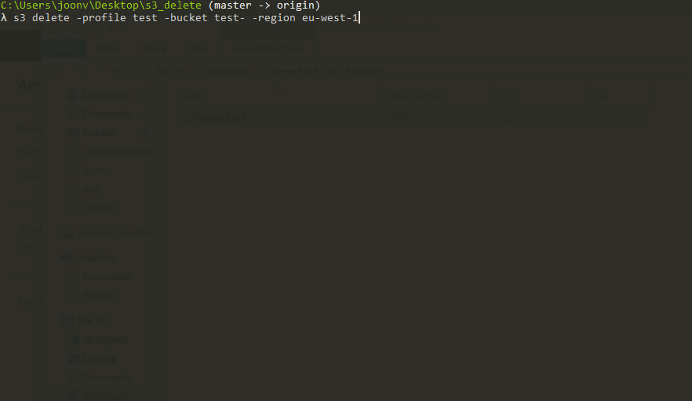

# S3_CLI

Simple tools to manage S3-buckets. Application is written in Go and uses [AWS SDK For Go](https://docs.aws.amazon.com/sdk-for-go/) to interact with S3.

## Installation

If you want to build it yourself:

```
go get -u github.com/aws/aws-sdk-go/...
go get github.com/olekukonko/tablewriter
# Windows users
go build -o s3.exe
# Unix
go build -o s3
```

Or you can download the binaries from [Releases](https://github.com/joonvena/S3_CLI/releases)

## Usage

##### List buckets

`s3 list -profile <profile>`

##### Delete buckets

`s3 delete -profile <profile> -bucket <bucket name> -region <region>`

Region is now optional argument:
`s3 delete -profile <profile> -bucket <bucket name>`



## Changes

###### 06.04.2020

- Now you can delete cross-region buckets

###### 05.04.2020

- Added tablewriter library to print out the bucket list nicely.
- Region is now displayed when buckets are listed.
