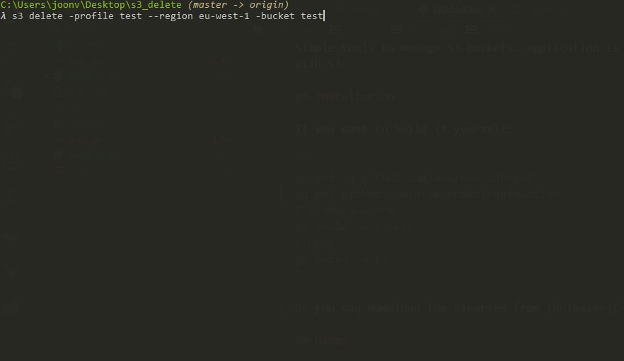

# S3_CLI

Simple tools to manage S3-buckets. Application is written in Go and uses [AWS SDK For Go](https://docs.aws.amazon.com/sdk-for-go/) to interact with S3.

Currently it can only list & delete buckets. You can provide full bucket name to be deleted or you can provide partial match that returns all the buckets matching the name. This delete command will also delete buckets that are not empty.

## Installation

If you want to build it yourself:

```
go get -u github.com/aws/aws-sdk-go/...
# Windows users
go build -o s3.exe
# Unix
go build -o s3
```

Or you can use the provided already compiled binaries

## Usage

##### List buckets

`s3 list -profile <profile>`

##### Delete buckets

`s3 delete -profile <profile> -bucket <bucket name> -region <region>`


